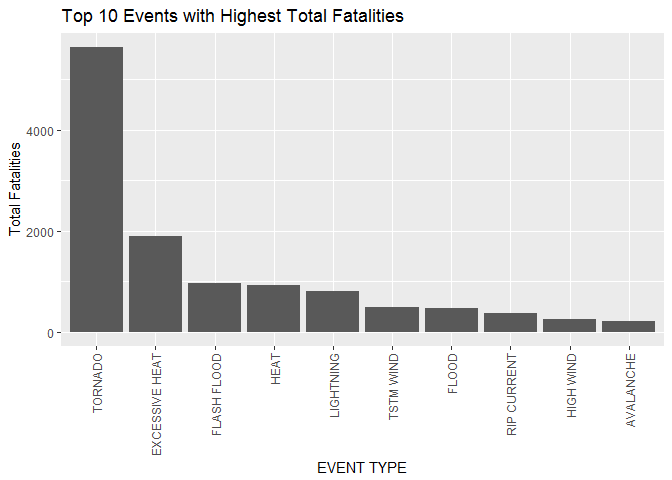
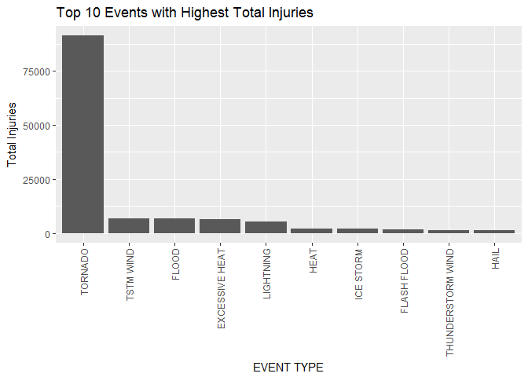
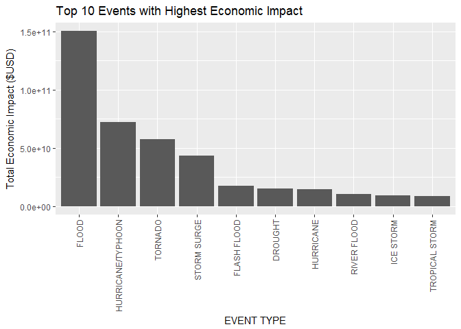

## I have problem using the "knitr" function in R Studio. All the codes can be run correctly; however, when using "knitr" there is an error message in this format:

## Error in UseMethod("select_") : no applicable method for 'select_' applied to an object of class "function" Calls: <Anonymous> ...  _fseq -> freduce -> <Anonymous> -> select -> select_

## I run out of ideas on how to deal with it (and I'm already late), so please bear with me that the submission is in md format.

Introduction
------------

Storms and other severe weather events can cause both public health and
economic problems for communities and municipalities. Many severe events
can result in fatalities, injuries, and property damage, and preventing
such outcomes to the extent possible is a key concern.

This project involves exploring the U.S. National Oceanic and
Atmospheric Administration's (NOAA) storm database. This database tracks
characteristics of major storms and weather events in the United States,
including when and where they occur, as well as estimates of any
fatalities, injuries, and property damage.

Data Download and Processing
----------------------------

The following code is used to download and read the data:

    url <- "https://d396qusza40orc.cloudfront.net/repdata%2Fdata%2FStormData.csv.bz2"
    download.file(url, "StormData.csv.bz2")

    library(R.utils)
    bunzip2("StormData.csv.bz2", "StormData.csv")

    df <- read.csv("StormData.csv")

Health Impact
-------------

To evaluate the health impact, the total fatalities and the total
injuries for each event type (EVTYPE) are calculated. The codes for this
calculation are shown as follows.

    library(knitr)
    library(dplyr)
    df.fatalities <- df %>% select(EVTYPE, FATALITIES) %>% group_by(EVTYPE) %>% summarise(total.fatalities = sum(FATALITIES)) %>% arrange(-total.fatalities)
    head(df.fatalities, 10)

    ## # A tibble: 10 × 2
    ##            EVTYPE total.fatalities
    ##            <fctr>            <dbl>
    ## 1         TORNADO             5633
    ## 2  EXCESSIVE HEAT             1903
    ## 3     FLASH FLOOD              978
    ## 4            HEAT              937
    ## 5       LIGHTNING              816
    ## 6       TSTM WIND              504
    ## 7           FLOOD              470
    ## 8     RIP CURRENT              368
    ## 9       HIGH WIND              248
    ## 10      AVALANCHE              224

    df.injuries <- df %>% select(EVTYPE, INJURIES) %>% group_by(EVTYPE) %>% summarise(total.injuries = sum(INJURIES)) %>% arrange(-total.injuries)
    head(df.injuries, 10)

    ## # A tibble: 10 × 2
    ##               EVTYPE total.injuries
    ##               <fctr>          <dbl>
    ## 1            TORNADO          91346
    ## 2          TSTM WIND           6957
    ## 3              FLOOD           6789
    ## 4     EXCESSIVE HEAT           6525
    ## 5          LIGHTNING           5230
    ## 6               HEAT           2100
    ## 7          ICE STORM           1975
    ## 8        FLASH FLOOD           1777
    ## 9  THUNDERSTORM WIND           1488
    ## 10              HAIL           1361

The top 10 events with the highest total fatalities and injuries are
shown graphically.

    library(ggplot2)
    g <- ggplot(df.fatalities[1:10,], aes(x=reorder(EVTYPE, -total.fatalities), y=total.fatalities))+geom_bar(stat="identity") + theme(axis.text.x = element_text(angle=90, vjust=0.5, hjust=1))+ggtitle("Top 10 Events with Highest Total Fatalities") +labs(x="EVENT TYPE", y="Total Fatalities")
    g

    g <- ggplot(df.injuries[1:10,], aes(x=reorder(EVTYPE, -total.injuries), y=total.injuries))+geom_bar(stat="identity") + theme(axis.text.x = element_text(angle=90, vjust=0.5, hjust=1))+ggtitle("Top 10 Events with Highest Total Injuries") +labs(x="EVENT TYPE", y="Total Injuries")
    g

As shown in the figures, tornado causes the hightest in both the total
fatality and injury count.

Economic Impact
---------------

The data provides two types of economic impact, namely property damage
(PROPDMG) and crop damage (CROPDMG). The actual damage in $USD is
indicated by PROPDMGEXP and CROPDMGEXP parameters. According to this
[link](https://rstudio-pubs-static.s3.amazonaws.com/58957_37b6723ee52b455990e149edde45e5b6.html),
the index in the PROPDMGEXP and CROPDMGEXP can be interpreted as the
following:-

H, h -&gt; hundreds = x100  
K, K -&gt; kilos = x1,000  
M, m -&gt; millions = x1,000,000   
B,b -&gt; billions = x1,000,000,000  
(+) -&gt; x1  
(-) -&gt; x0  
(?) -&gt; x0  
blank -&gt; x0  

The total damage caused by each event type is calculated with the
following code.

    df.damage <- df %>% select(EVTYPE, PROPDMG,PROPDMGEXP,CROPDMG,CROPDMGEXP)

    Symbol <- sort(unique(as.character(df.damage$PROPDMGEXP)))
    Multiplier <- c(0,0,0,1,10,10,10,10,10,10,10,10,10,10^9,10^2,10^2,10^3,10^6,10^6)
    convert.Multiplier <- data.frame(Symbol, Multiplier)

    df.damage$Prop.Multiplier <- convert.Multiplier$Multiplier[match(df.damage$PROPDMGEXP, convert.Multiplier$Symbol)]
    df.damage$Crop.Multiplier <- convert.Multiplier$Multiplier[match(df.damage$CROPDMGEXP, convert.Multiplier$Symbol)]

    df.damage <- df.damage %>% mutate(PROPDMG = PROPDMG*Prop.Multiplier) %>% mutate(CROPDMG = CROPDMG*Crop.Multiplier) %>% mutate(TOTAL.DMG = PROPDMG+CROPDMG)

    df.damage.total <- df.damage %>% group_by(EVTYPE) %>% summarize(TOTAL.DMG.EVTYPE = sum(TOTAL.DMG))%>% arrange(-TOTAL.DMG.EVTYPE) 

    head(df.damage.total,10)

    ## # A tibble: 10 × 2
    ##               EVTYPE TOTAL.DMG.EVTYPE
    ##               <fctr>            <dbl>
    ## 1              FLOOD     150319678250
    ## 2  HURRICANE/TYPHOON      71913712800
    ## 3            TORNADO      57352117607
    ## 4        STORM SURGE      43323541000
    ## 5        FLASH FLOOD      17562132111
    ## 6            DROUGHT      15018672000
    ## 7          HURRICANE      14610229010
    ## 8        RIVER FLOOD      10148404500
    ## 9          ICE STORM       8967041810
    ## 10    TROPICAL STORM       8382236550

The top 10 events with the highest total economic damages (property and
crop combined) are shown graphically.

    g <- ggplot(df.damage.total[1:10,], aes(x=reorder(EVTYPE, -TOTAL.DMG.EVTYPE), y=TOTAL.DMG.EVTYPE))+geom_bar(stat="identity") + theme(axis.text.x = element_text(angle=90, vjust=0.5, hjust=1))+ggtitle("Top 10 Events with Highest Economic Impact") +labs(x="EVENT TYPE", y="Total Economic Impact ($USD)")

    g

As shown in the figure, flood has the highest economic impact.
